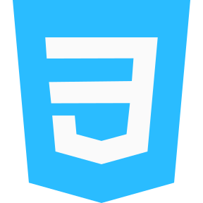

<h1 align = "center">👋 Hello, I'm Om</h1>

 📌 I'm currently working on <a href = "https://github.com/itsomkathe/Voicey">Voicey</a>

<h3 align = "center">Languages, Frameworks and Tools</h3>

      

   

<h3 align="center">Coding Profiles</h3>

 <ahref="https://auth.geeksforgeeks.org/user/omkathe26" target="_blank"></a>

<h3 align="center">Connect with me</h3>
   <a href="https://twitter.com/HamiltonPharmD" target="_blank"> 

  

<!---
itsomkathe/itsomkathe is a ✨ special ✨ repository because its `README.md` (this file) appears on your GitHub profile.
You can click the Preview link to take a look at your changes.
--->
